# 5일차. 스트리밍 파이프라인 실습

> 로컬 경로에 주기적으로 생성되는 파일을 `플루언트디`를 통해 **카프카**에 저장하고, 이렇게 저장된 데이터를 `스파크 스트리밍`을 통해 변환(enrich) 후, **카프카**에 다시 저장한 뒤, **드루이드** `카프카 적재기`를 통해서 드루이드 테이블로 적재 후, **터닐로**를 통해 실시간 지표를 조회하는 실습을 합니다  

> 전체 파이프라인은 `tsv@file -> fluentd -> json@kafka -> spark-streaming -> json@kafka -> druid -> turnilo` 순서대로 흘러갑니다  

## 1. 최신버전 업데이트
> 원격 터미널에 접속하여 관련 코드를 최신 버전으로 내려받고, 과거에 실행된 컨테이너가 없는지 확인하고 종료합니다  

### 1-1. 최신 소스를 내려 받습니다
> 자주 사용하는 명령어는 `alias` 를 걸어둡니다  

```bash
# terminal
cd /home/ubuntu/work/data-engineer-advanced-training
git pull

# alias
alias d="docker-compose"
```

### 1-2. 이전에 기동된 컨테이너가 있다면 강제 종료합니다
```bash
# terminal 
docker rm -f `docker ps -aq`
`docker ps -a` 명령으로 결과가 없다면 모든 컨테이너가 종료되었다고 보시면 됩니다
```

### 1-3. 실습을 위한 이미지를 내려받고 컨테이너를 기동합니다
```bash
# 컨테이너 기동
cd /home/ubuntu/work/data-engineer-advanced-training/day5
docker-compose pull
docker-compose up -d

# 컨테이너 확인
docker-compose ps

# 컨테이너 접속 (fluentd, kafka)
docker-compose exec fluentd bash
docker-compose exec kafka bash
```


## 2. 로컬 파일을 *플루언트디*를 통해 *카프카* `movies` 토픽으로 전송	

### 2-1. `fluentd` 컨테이너에 접속하여 http 더미 에이전트를 실행합니다
> 홈 경로가 `/home/root` 이며 해당 경로에 `fluentd` 스크립트가 존재합니다  

* http 서버를 특정 포트로 띄우고 debug 출력을 하는 예제
```xml
<source>
    type http
    port 9881
</source>
<match debug>
    type stdout
</match>
```

* http 소스 에이전트 실행 - default: `/etc/fluentd/fluent.conf`
```bash
# ./fluentd
./fluentd -c /etc/fluentd/fluent.conf
```* curl 명령을 통해서 테스트
```bash
curl -X POST -d 'json={"message":"hello"}' localhost:9881/debug
```

### 2-2. 로컬 파일을 읽어서 콘솔로 출력하는 예제를 생성합니다
> 디버깅 출력을 위한 match 설정은 그대로 두고,  `/fluentd/source/movies.tsv` 파일을 읽어서 `debug` 태그를 붙여서 출력하도록 `fluent.conf` 파일을 생성하세요  

* tail 플러그인을 통하여 파일을 읽는 소스 설정을 생성합니다
  * [2일차 스트리밍 파일 수집](https://github.com/psyoblade/data-engineer-advanced-training/tree/lgde/2022/day2) 참고하여 `/fluentd/config/fluent-2-2.conf`작성합니다
```xml
<source>
    @type tail
    @log_level info
    path {수집 대상 파일명 혹은 경로}
    pos_file /fluentd/source/movies.pos
    refresh_interval 10
    multiline_flush_interval 10
    rotate_wait 10
    open_on_every_update true
    emit_unmatched_lines true
    read_from_head true
    tag {태그}
    <parse>
        @type tsv
        time_type unixtime
        time_key time
        keys time,movie,title,title_eng,year,grade
        types time:integer,movie:string,title:string,title_eng:string,year:integer,grade:string
        keep_time_key true
    </parse>
</source>
<match {태그}>
    type stdout
</match>
```

* 디버깅 출력이 정상인지 확인합니다
```bash
./fluentd -c /fluentd/config/fluent-2-2.conf
```

### 2-3. kafka 플러그인을 활용하여 movies 토픽으로 메시지를 전송합니다
> 파일소스의 태그를 `debug` 에서 `info`로 변경하고 `kafka` 플러그인 설정을 `/fluentd/config/fluent-2-3.conf` 파일을 작성합니다  그리고 `/fluentd/source/movies.pos` 파일을 삭제해야 이전 상태가 초기화 되어 수집됩니다.

* kafka 브로커는 `kafka:9093` 으로 전송되어야 하며, 생성 시에 `movies` 토픽이 생성되어 있으므로 그 쪽으로 전송하면 됩니다.
```xml
<match info>
    @type kafka2

    brokers {카프카주소:포트}
    use_event_time false

    <buffer topic>
        @type file
        path /var/log/td-agent/buffer/td
        flush_interval 5s
    </buffer>

    <format>
        @type json
    </format>

    default_topic {카프카토픽}
    required_acks -1
    compression_codec gzip
</match>
```

* 파일 소스와 카프카 매치 구성이 완료되었다면 전송 테스트를 합니다
	* 이전에 생성 했던 pos 파일이 삭제 되어야 정상 전송이 됩니다.
```bash
rm /fluentd/source/movies.pos
./fluentd -c /fluentd/config/fluent-2-3.conf
```


### 2-4. kafka 콘솔 컨슈머를 활용하여 movies 토픽 메시지를 확인합니다
> 카프카에 정상적으로 메시지가 적재되는지 확인합니다  

* 카프카 설치 경로 `/opt/kafka` 로 이동하여 콘솔 컨슈머를 통해 확인합니다
	* 자주 사용하는 `—bootstrap-server` 옵션은 변수로 저장해 둡니다
```bash
d exec kafka bash
cd /opt/kafka
boot="--bootstrap-server localhost:9093"
bin/kafka-console-consumer.sh $boot --topic movies --from-beginning --max-messages 5
```


## 3. *카프카* `movies` 토픽의 메시지를 *스파크 스트리밍*을 통해 `korean_movies` 토픽으로 전송합니다.

### 3-1. 노트북을 열어서 스파크 세션을 생성 후, 스파크 버전을. 확인합니다
* 노트북 접속을 위해 주소를 확인하여 브라우저에서 접속합니다
	* 단, 클라우드 환경인 경우에는 클라우드 노드의 주소를 `127.0.0.1` 대신에 넣어야 합니다
```bash
docker-comopse logs notebook | grep 127
# [JupyterLab](http://127.0.0.1:8888/lab?token=d0ffa88b4ca509687f7a6502e4376f1bbf192bd8462f83c2)
```

* 스파크 세선을 성성하고 버전을 확인합니다.
	* 상세한 가이드는 [Spark Streaming + Kafka Integration Guide (Kafka broker version 0.10.0 or higher) - Spark 3.2.1 Documentation](https://spark.apache.org/docs/3.2.1/streaming-kafka-0-10-integration.html) 를 참고 합니다.
```python
from pyspark.sql import *
from pyspark.sql.functions import *
from pyspark.sql.types import *
from IPython.display import display, display_pretty, clear_output, JSON

spark = (
    SparkSession
    .builder
    .config("spark.sql.session.timeZone", "Asia/Seoul")
    .getOrCreate()
)

# 노트북에서 테이블 형태로 데이터 프레임 출력을 위한 설정을 합니다
spark.conf.set("spark.sql.repl.eagerEval.enabled", True) # display enabled
spark.conf.set("spark.sql.repl.eagerEval.truncate", 100) # display output columns size

# 공통 데이터 위치
home_jovyan = "/home/jovyan"
work_data = f"{home_jovyan}/work/data"
work_dir=!pwd
work_dir = work_dir[0]

# 로컬 환경 최적화
spark.conf.set("spark.sql.shuffle.partitions", 5) # the number of partitions to use when shuffling data for joins or aggregations.
spark.conf.set("spark.sql.streaming.forceDeleteTempCheckpointLocation", "true")

# 현재 기동된 스파크 애플리케이션의 포트를 확인하기 위해 스파크 정보를 출력합니다
spark
```

* 노트북에서 스파크 스트리밍 상태 및 데이터 조회를 위한 함수 선언
```python
# 스트림 테이블을 주기적으로 조회하는 함수 (name: 이름, sql: Spark SQL, iterations: 반복횟수, sleep_secs: 인터벌)
def displayStream(name, sql, iterations, sleep_secs):
    from time import sleep
    i = 1
    for x in range(iterations):
        clear_output(wait=True)              # 출력 Cell 을 지웁니다
        display('[' + name + '] Iteration: '+str(i)+', Query: '+sql)
        display(spark.sql(sql))              # Spark SQL 을 수행합니다
        sleep(sleep_secs)                    # sleep_secs 초 만큼 대기합니다
        i += 1

# 스트림 쿼리의 상태를 주기적으로 조회하는 함수 (name: 이름, query: Streaming Query, iterations: 반복횟수, sleep_secs: 인터벌)
def displayStatus(name, query, iterations, sleep_secs):
    from time import sleep
    i = 1
    for x in range(iterations):
        clear_output(wait=True)      # Output Cell 의 내용을 지웁니다
        display('[' + name + '] Iteration: '+str(i)+', Status: '+query.status['message'])
        display(query.lastProgress)  # 마지막 수행된 쿼리의 상태를 출력합니다
        sleep(sleep_secs)            # 지정된 시간(초)을 대기합니다
        i += 1
```

### 3-2. 카프카로부터 메시지 수신을 위한 카프카 리더를 생성합니다
```python
kafkaReader = spark \
  .readStream \
  .format("kafka") \
  .option("kafka.bootstrap.servers", "카프카주소:포트") \
  .option("subscribe", "카프카토픽") \
  .option("startingOffsets", "earliest") \
  .load()

kafkaReader.printSchema()
# {"movie":"10225","title":"핑크 팬더 6 - 핑크 팬더의 추적","title_eng":"Trail Of The Pink Panther , 1982","year":0,"grade":"PG","time":"2022-07-17 04:19:42"}

kafkaSchema = (
    StructType()
    .add(StructField("movie", StringType()))
    .add(StructField("title", StringType()))
    .add(StructField("title_eng", StringType()))
    .add(StructField("year", IntegerType()))
    .add(StructField("grade", StringType()))
    .add(StructField("time", StringType()))
)
# root
#  |-- key: binary (nullable = true)
#  |-- value: binary (nullable = true)
#  |-- topic: string (nullable = true)
#  |-- partition: integer (nullable = true)
#  |-- offset: long (nullable = true)
#  |-- timestamp: timestamp (nullable = true)
#  |-- timestampType: integer (nullable = true)

kafkaSelector = (
    kafkaReader
    .select(
        col("key").cast("string"),
        from_json(col("value").cast("string"), kafkaSchema).alias("movies")
    )
    .selectExpr("movies.movie as key", "to_json(struct(movies.*)) as value")
)

kafkaSelector.printSchema()
# root
#  |-- title: string (nullable = true)
#  |-- year: integer (nullable = true)
```


### 3-3. 카프카 `movies` 토픽으로부터 읽어온 메시지를 노트북에서 확인합니다
> 스트리밍 데이터는 디버깅이 상당히 어렵기 때문에 새로운 카프카 토픽 혹은 외부에 저장하기 전에 반드시 눈으로 확인해야 합니다  

* 위에서 선언한 `displayStream` 함수를 활용하여 메시지를 읽어서 출력합니다.
```python
# 노트북 로그 콘솔로 출력
queryName = "consoleSink"
kafkaWriter = (
    kafkaSelector.select("key", "value")
    .writeStream
    .queryName(queryName)
    .format("memory")
    .outputMode("append")
)

checkpointLocation = f"{work_dir}/tmp/{queryName}"
!rm -rf $checkpointLocation

kafkaTrigger = (
    kafkaWriter
    .trigger(processingTime="5 second")
    .option("checkpointLocation", checkpointLocation)
)
kafkaQuery = kafkaTrigger.start()

# 파이썬의 경우 콘솔 디버깅이 노트북 표준출력으로 나오기 때문에, 별도 메모리 테이블로 조회
displayStream(queryName, f"select * from {queryName} order by key desc", 4, 5)
kafkaQuery.stop()
```


### 3-4. 카프카 `movies` 토픽을 새로운 토픽 `korean_movies` 로 출력 합니다
> 예제에서는 거의 원본 그대로를 출력하지만, 실제로는 Dimension 테이블과 Join 을 하거나, 데이터 가공 및 변환 등의 Enrich 단계를 수행하며, 우리 예제 에서는 `kafkaSelect` 부분만 수정하면 됩니다.  

* 새로운 토픽 `korean_movies` 으로 전송을 위해 `kafkaWriter` 코드만 다시 작성합니다.
```python
# 카프카로 다시 저장
queryName = "kafkaSink"
kafkaWriter = (
    kafkaSelector.select("key", "value")
    .writeStream
    .queryName(queryName)
    .format("kafka")
    .option("kafka.bootstrap.servers", "카프카주소:포트")
    .option("topic", "새로운토픽")
    .outputMode("append")
)

checkpointLocation = f"{work_dir}/tmp/{queryName}"
!rm -rf $checkpointLocation

kafkaTrigger = (
    kafkaWriter
    .trigger(processingTime="5 second")
    .option("checkpointLocation", checkpointLocation)
)
kafkaQuery = kafkaTrigger.start()

displayStatus(queryName, kafkaQuery, 100, 10)
kafkaQuery.stop()
```


## 4. *카프카*에 저장된 `korean_movies` 토픽을 *드루이드* `kafka-index`를 통해 적재합니다
> 드루이드에는 카프카 토픽에 저장된 데이터를 드루이드 테이블로 색인할 수 있는 엔진을 제공합니다. http://localhost:8088 으로 접속하여 관리자 도구를 통해 적재할 수 있습니다.  

### 4-1. 드루이드 카프카 적재기를 통해 드루이드 테이블 색인을 수행합니다
> 캡쳐된 화면을 통해서 순서대로 진행하면 됩니다.  

* 대시보드에서는 수행할 수 있는 모든 작업을 확인할 수 있습니다
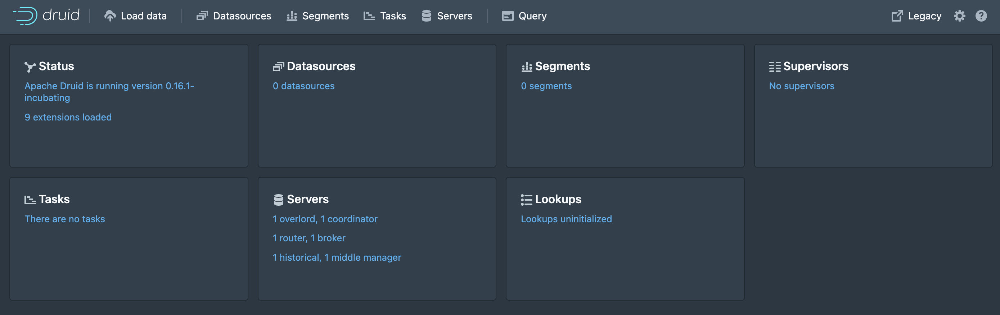

* 첫 번째 메뉴`Load data`를 선택하고, `Start a new spec`을 클릭하여 외부 데이터를 입수합니다
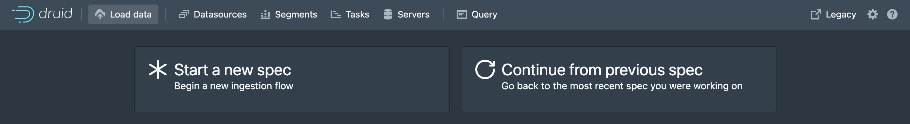

* `Apache Kafka` 를 선택합니다.
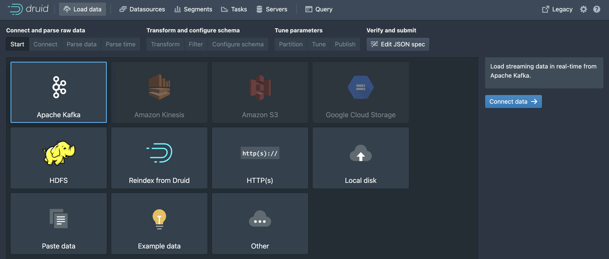

* 접속 가능한 카프카 클러스터의 브로커 `kafka:9093` 및 토픽 `korean_movies`를 입력하고 Preview 를 선택합니다
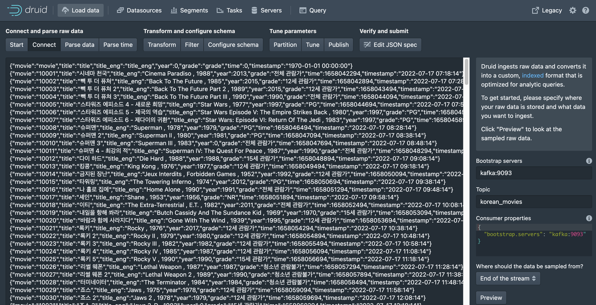
  - 여기서 카프카 오프셋 처음(earliest) 혹은 최근(latest)부터를 선택할 수 있습니다

* 입력 데이터의 포맷(json, csv, tsv 등)을 선택합니다
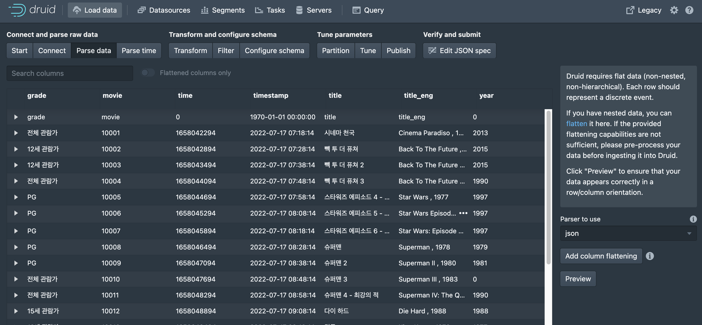

* 시간 컬럼을 선택해야 하는데, 표준포맷(yyyy-MM-dd HH:mm:dd)인 `timestamp` 컬럼을 선택합니다
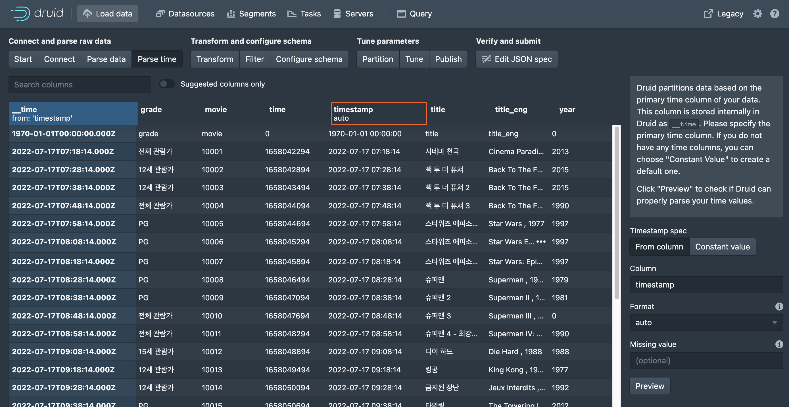
  - 시간 컬럼이 없다면 상수값을 넣거나, 선택하여 파싱하는 방법도 있습니다만, 애초에 정상적인 시간을 생성해서 받아오는 것이 좋습니다

* 제공하는 함수 등을 이용하여 컬럼을 추가할 수 있습니다
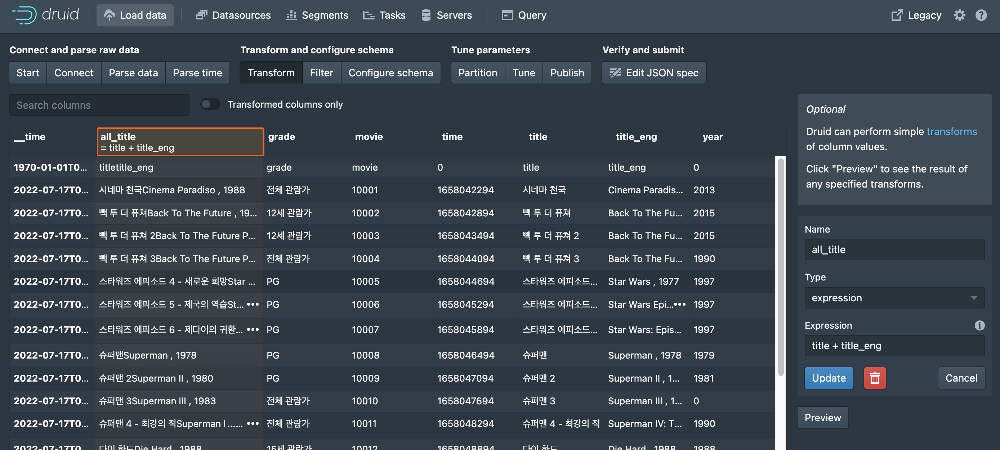
  - [druid expression](https://druid.apache.org/docs//0.15.1-incubating/misc/math-expr.html) 페이지를 참고합니다

* 제공하는 필터 함수를 이용하여 원하는 데이터만 필터링 할 수 있습니다
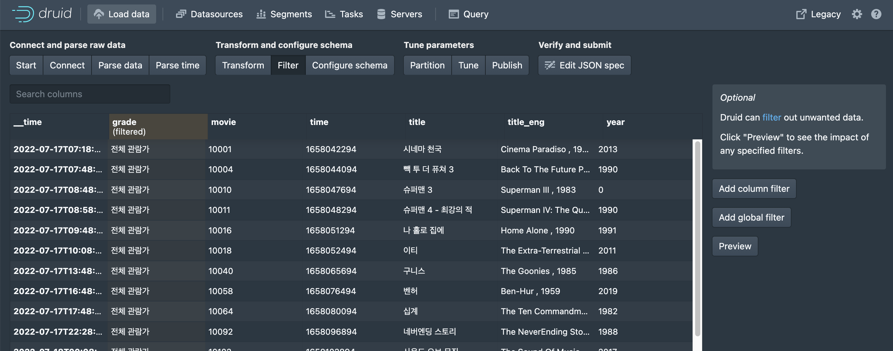
  - [druid filters](https://druid.apache.org/docs//0.15.1-incubating/querying/filters.html) 페이지를 참고합니다

* 최종 스키마를 결정할 수 있으며, 자동으로 생성되는 숫자 컬럼은 제거합니다
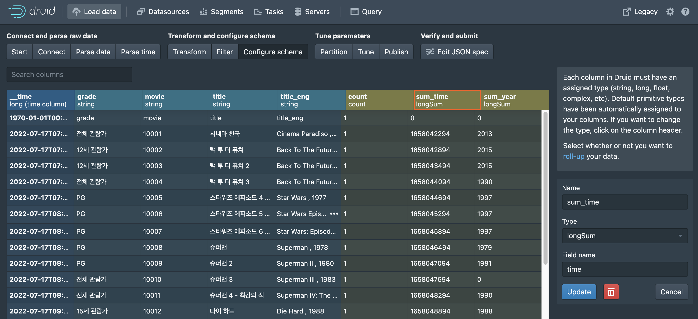

* 테이블의 파티션 구성을 설계할 수 있습니다

  - [Segment](https://druid.apache.org/docs/latest/design/segments.html) 설정은 데이터의 특성에 따라 조정이 필요함
  - Segment granularity : 엔진 특성상 Roll-Up을 통해서 성능을 끌어올려야 하므로, 중복가능한 지표의 특성을 고려해야 한다
  - Max rows per segment :
  - Max total rows :

* 성능 및 튜닝을 위한 설정
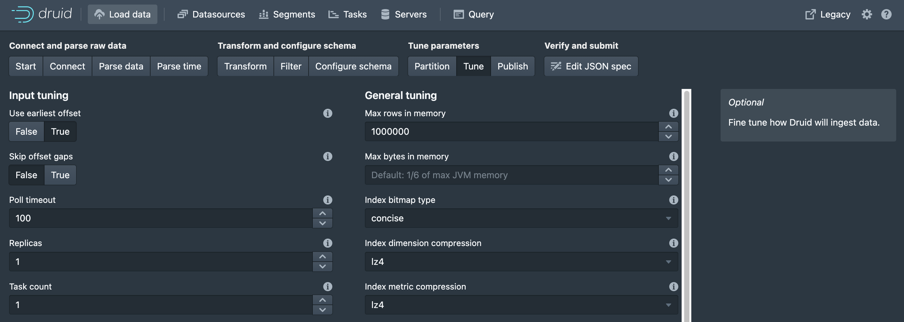
  - earliest offset :
  - skip offset gaps 
  - poll timeout
  - replicas
  - task count
  - max rows in memory
  - index bitmap type

* 테이블 이름 및 최종 배포 설정
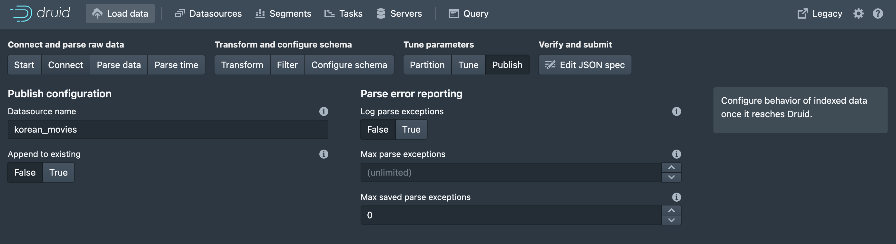
  - append to existing 
  - log parse exceptions

* 최종 생성된 요청 내역을 확인
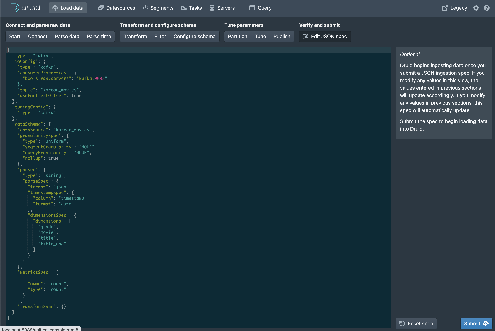
  - 여기서 내용을 수정하면 앞에서 UI 수정을 다시 해야 하므로, 내용을 잘 이해하는 부분이 아니라면 수정하지 않는 것을 추천합니다

* 최종 결과를 제출하면 타스크 탭으로 이동하여 확인이 가능합니다
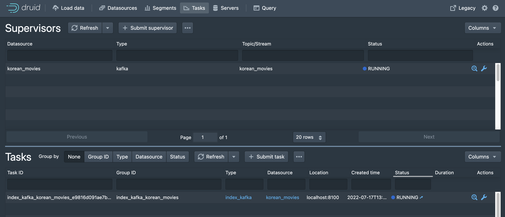
  - 모든 색인 및 백그라운드 작업은 `Tasks` 탭에서 수행됩니다

* 정상적으로 작업이 적재되었다면 조회가 가능합니다
  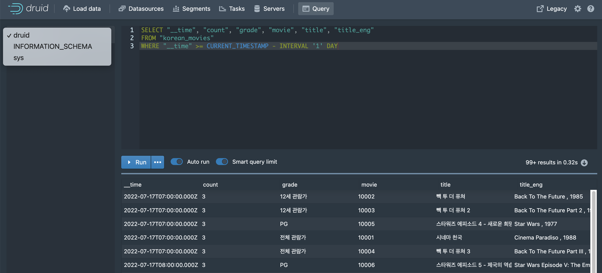
  - 대상 테이블을 선택하고 실시간 테이블 조회가 가능합니다


## 5. *드루이드*에 적재된 `korean_movies` 테이블을 *터닐로*를 통해 시각화 합니다

### 5-1. 터닐로 명령어를 통해서 드루이드 테이블 설정을 생성합니다
> 아래의 명령을 통해서 설정 파일을 생성하고, 수정하여 다시 덮어쓸 수도 있습니다
```bash
docker-compose run turnilo turnilo --druid http://druid:8082 --print-config --with-comments
```

### 5-2. 터닐로가 드루이드 테이블을 인식하게 하기 위해 컨테이너를 재시작합니다
```bash
docker-compose restart turnilo
```

### 5-3. 웹 페이지를 통해 실시간 지표 조회 및 탐색을 수행합니다
> http://localhost:9091 사이트에 접속합니다

* 접속하면 `korean_movies` 페이지를 확인할 수 있습니다
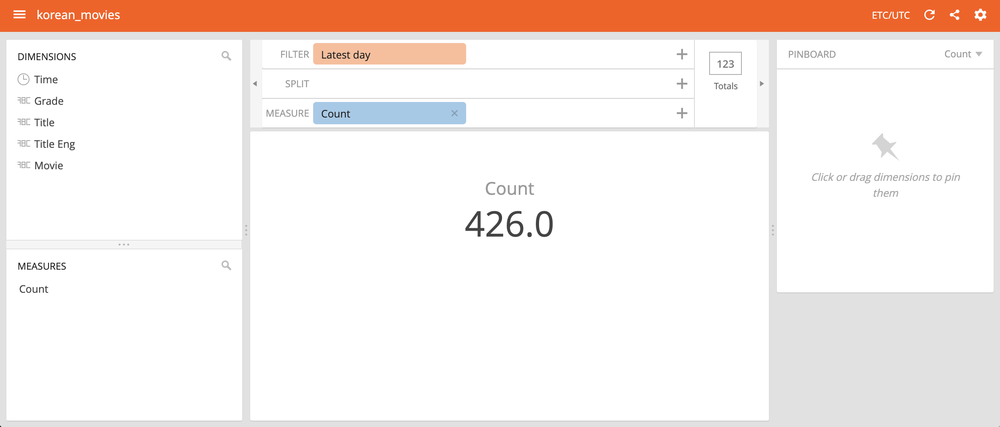

* 기본적으로 드래그앤드랍 방식으로 탐험이 가능합니다 
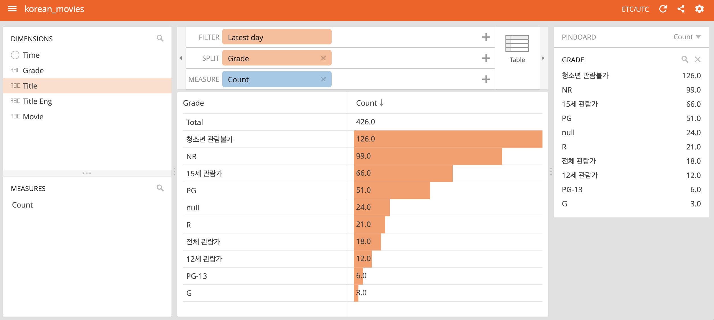

* 우측의 차트종류에 따라 집계 축이 달라지는 경우가 있으므로 주의합니다
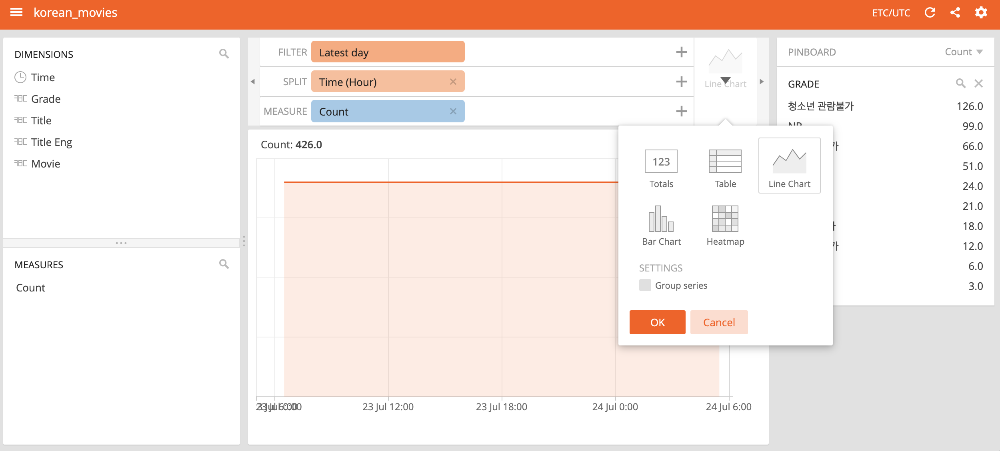

* 디멘젼의 경우 핀해 두고, 자주 사용하는 필터로 사용할 수 있습니다
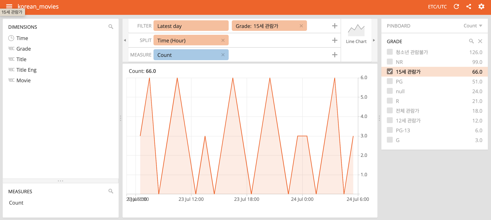

* 데이터입력 시간을 UTC기준으로 적재하고, 타임존에 따라 조회할 수 있습니다
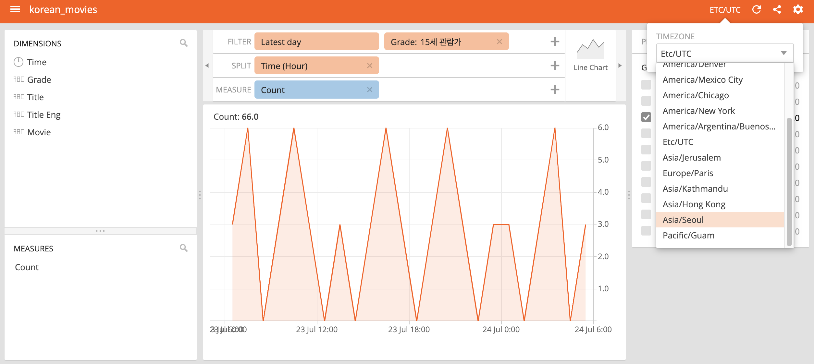

* 인터벌을 지정하고 주기적으로 리프래시하여 대시보드와 같이 사용할 수 있습니다
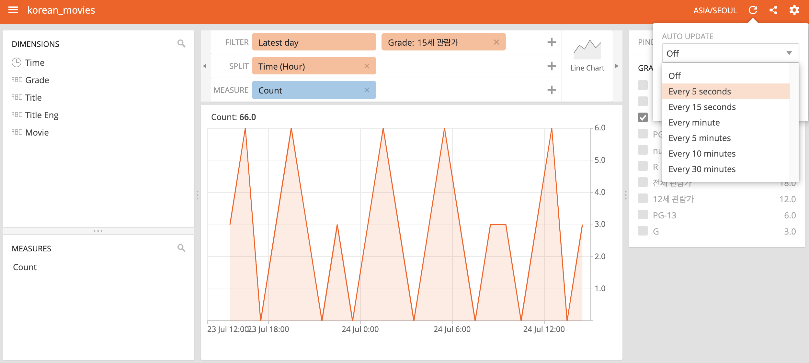


## 6. 잘못 적재된 토픽을 삭제하고 다시 적재해야 하는 경우
> 카프카의 경우 메시지의 일부 혹은 특정 구간을 삭제하는 방법은 없습니다. 임의의 오프셋 이후부터 적재 혹은 가장 마지막 시점부터 수행하는 방법이 어렵다면 모든 토픽을 삭제하고 다시 생성하는 방법을 선택할 수 있습니다.  

* 토픽을 삭제합니다.
```bash
docker-compose exec kafka bash
cd /opt/kafka
boot="--bootstrap-server localhost:9093"
bin/kafka-topics.sh $boot --delete --topic "토픽이름"
```

* 토픽 목록을 가져옵니다
```bash
bin/kafka-topics.sh $boot --list
```

* 새로운 토픽을 생성합니다
	* 기본적으로 적재 시에 자동으로 생성되지만, 파티션 및 복제 수는 기본값으로 설정되므로 수동으로 생성하는 편이 좋습니다
```bash
bin/kafka-topics.sh $boot --create --topic "토픽이름" --partitions 1 --replication-factor 1 --config retention.ms=3600000
```


## 7. 도커 컨테이너가 정상동작하지 않는 경우
* 데스크톱 환경에서는 도커 데스크톱을 재시작 하면 되지만 리눅스 환경의 경우는 서비스를 재기동 해야만 합니다.
```bash
sudo systemctl restart docker.service
```


## 레퍼런스
* [java. duration](https://docs.oracle.com/javase/8/docs/api/java/time/Duration.html)
* [fluentd parse](https://docs.fluentd.org/configuration/parse-section)
* [fluentd kafka](https://docs.fluentd.org/output/kafka)
* [fluentd tail](https://docs.fluentd.org/input/tail)
* [fluentd tsv](https://docs.fluentd.org/parser/tsv)
